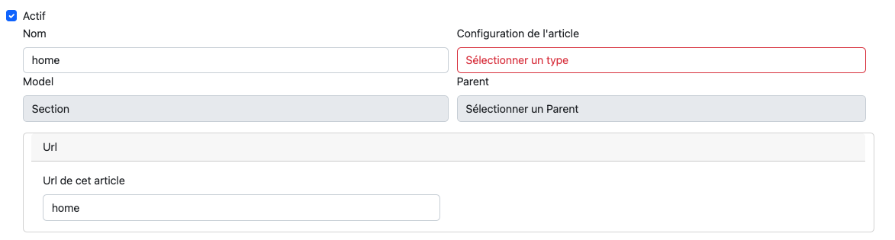
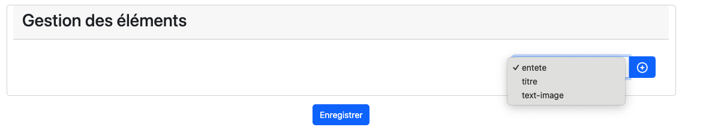
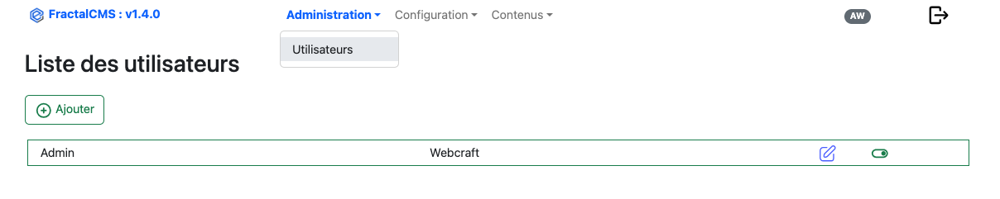
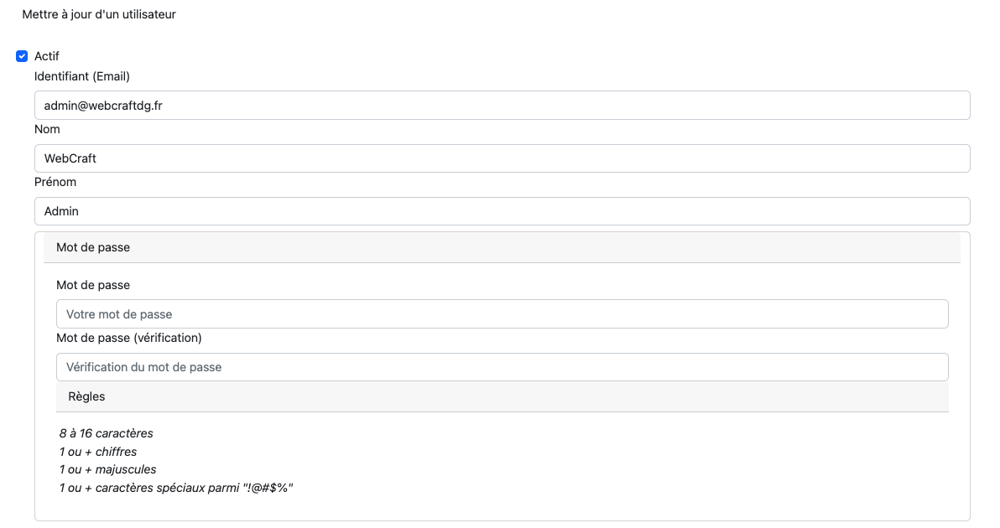

# Contenu

## Gestion des articles

### Prérequis

Avant de créer un article (Content), veuillez créer une **[Configuration du type d'élément](03-configuration.md#gestion-de-la-configuration-des-éléménts)**.

### Interface

Les articles suivent une structure définie par l'attribut **pathKey**.
Lors de l'initialisation de FractalCMS le **Content** "main" a été créé.

Tous les autres **Content** devront être des enfants ou petits enfants de "main".

Dans la pratique le **Content** "main" est la section qui va définir la page **accueil** du site.


#### Editer / Ajouter

L'édition d'un article se réalise en cliquant sur le stylet de la ligne.
La création se réalise en cliquant sur le bouton 'Ajouter'.

#### Identification de l'article (partie haute du formulaire)



* Actif : l'article doit-être actif pour être visible sur le front
* Nom : Nom de l'article (cette valeur doit être unique dans le site)
* Configuration de l'article : liste de choix liée aux configurations créés dans [Configuration du type des articles](03-configuration.md#gestion-des-types-darticle)
* Model : indique si l'article est une **section** ou un **article**
* Parent : Hiérarchie de l'article
* Url : Url à partir de laquelle l'article sera accessible sur le front

##### Configuration de l'article

Cette option permet de définir vers quelle **contrôleur/action** l'url de l'article sera dirigé afin
de construire la vue et l'envoyer au Front.

##### Model

###### Section

Modèle du plus haut niveau dans la hiérarchie, il peut appartenir à une autre **section** mais ne peut-être sous un article.

###### Article

Modèle du plus bas niveau dans la hiérarchie, il ne peut-être que l'enfant d'un modèle **section**

##### Parent

Position dans la hiérarchie de FractalCMS.

##### Url (valeur unique)

L'url est le point d'entrée sur le front (navigateur) afin d'accéder à la page de l'article

Cette valeur doit-être unique dans FractalCMS afin d'être sûr d'accéder à la bonne page sur le front.

#### SEO

Le SEO, défini les valeurs à indiquer dans la page afin de valoriser des données récupérées pour l'indéxation du site. 

FractalCMS met à disposition le **behavior** **fractalCms\behaviors\Seo** qui peut-être utilisé afin de générer le SEO.


* Actif : Activé le SEO
* Titre : titre visible sur l'onglet du navigateur
* Description : valeur du **meta** **name:description**
* Image : valeur du **meta** **name:image**
* Sitemap : paramètre inscrit dans le sitemap.xml pour l'url de cette article
* Meta données : Permet d'activer les metas données supplémentaire

##### Sitemap

FractalCMS met à disposition l'action **fractalCms\actions\SitemapAction** qui se charge de générer le fichier sitemap.xml.

##### Meta données

Le jsonLd doit-être créé selon les articles et le contexte du site.

##### Exemple utilisation du Behavior _fractalCms\behaviors\Seo_

Dans le controller 

```
public function behaviors()
{
    $behaviors = parent::behaviors();
    $behaviors['seo'] = [
        'class' => Seo::class
    ];
    return $behaviors;
}
```
Si le SEO est activé dans les paramètre du formulaire de l'article. Les données SEO seront automatiquement
insérées.

#### Gestion des éléments

Ici, ce trouve la coeur de la page. chaque article qu'il soit **section** ou **article** peut comporter des éléments.

Chaque élément est basé sur une configuration voir : [Gestion de la configuration des éléménts](03-configuration.md#gestion-de-la-configuration-des-éléménts).


##### Ajout d'un élément

Dans la liste en bas à droite, il faut sélectionner l'élément choisi et cliquer sur **+**.

La liste contient les *configurations éléments* précédemment créés [Gestion de la configuration des éléménts](03-configuration.md#gestion-de-la-configuration-des-éléménts).




L'élément peut-être valorisé. Les informations enregistrées pourront être utilisées sur le _FRONT_ de votre site.

##### Récupération des données dans la vue

###### Action Contrôleur (ContentController)

```
    public function actionIndex()
    {
        try {
            Yii::debug('Trace :'.__METHOD__, __METHOD__);
            $content = $this->getContent();
            //Recherche du premier élément "entete" du "Content"
            $itemEntete = $content->getItems()
                ->andWhere(['configItemId' => Cms::getParameter('ITEM', 'ENTETE')])
                ->one();
            return $this->render('index',
                [
                    'content' => $content,
                    'entete' => $itemEntete,
                    ]);
        } catch (Exception $e) {
            Yii::error($e->getMessage(), __METHOD__);
            throw $e;
        }
    }
```

##### Vue HTML

```
<?php
/**
 * main.php
 *
 * PHP Version 8.2+
 *
 * @version XXX
 * @package webapp\views\layouts
 *
 * @var $this yii\web\View
 * @var $content \fractalCms\models\Content
 * @var $entete \fractalCms\models\Item
 *
 */
use fractalCms\helpers\Html;

$title = ($entete instanceof \fractalCms\models\Item) ? $entete->title : $content->name;
$subtitle = ($entete instanceof \fractalCms\models\Item) ? $entete->subtitle : null;
$banner = ($entete instanceof \fractalCms\models\Item) ? $entete->banner : null;
$description = ($entete instanceof \fractalCms\models\Item) ? $entete->description : null;
$this->title = $title;

?>
<main id="main" role="main"  tabindex="-1" portfolio-focus="main">
    <!-- Hero avec image -->
    <section id="home" class="relative text-white">
        <!-- Image de fond -->
        <div class="absolute inset-0 h-72">
            <?php
            if (empty($banner) === false) {
                echo Html::img($banner, [
                    'width' => 1200, 'height' => 300,
                    'alt' => 'Image hero',
                    'class' => 'w-full h-full object-cover'
                ]);
            }
            ?>
            <!-- Overlay -->
            <div class="absolute inset-0 bg-blue-800 opacity-70"></div>
        </div>

        <!-- Contenu -->
        <div class="relative container mx-auto px-6 h-72 flex flex-col justify-center items-center text-center">
            <h1 class="text-3xl md:text-5xl font-extrabold"><?php echo $title;?></h1>
            <div class="mt-2 text-lg text-blue-100">
                <?php echo $description;?>
            </div>
        </div>
    </section>
</main>
```

## Gestion des utilisateurs et droits

### Règle de modification

* Un utilisateur ne peut modifier ses droits et permissions

### Utilisateur administrateur

#### Commande de création

Afin d'accéder pour la première fois à l'interface administrateur, il faut créer un utilisateur.
Pour cela, la commande suivante permet de créer cet utilisateur.

``
php yii.php fractalCms:admin/create
``

#### Interface

La première page liste les utilisateurs déjà créés dans l'application.



#### Editer / Ajouter

L'édition d'un utilisateur se réalise en cliquant sur le stylet de la ligne.
La création se réalise en cliquant sur le bouton 'Ajouter'.

#### Partie haute du formulaire



Dans cette interface, il faut indiquer, l'identifiant (email), le nom, prénom et le mot de passe.
Le mot de passe est soumit à des règles de validations indiquées dans le formulaire.

La case à cocher 'Activer' permet d'activer ou désactiver un utilisateur. tant que l'utilisateur n'est pas activer, il ne pourra
pas se connecter.

#### Les droits et permissions


La configuration des droits et permissions permet de restreindre l'accès à certaines fonctionnalités de FractalCMS.

[<- Précédent](04-interface.md) | [Suivant ->](06-avance.md)