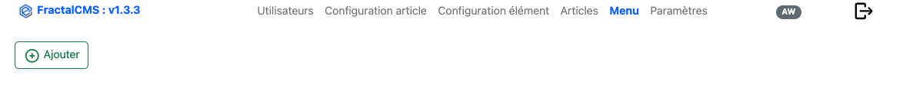
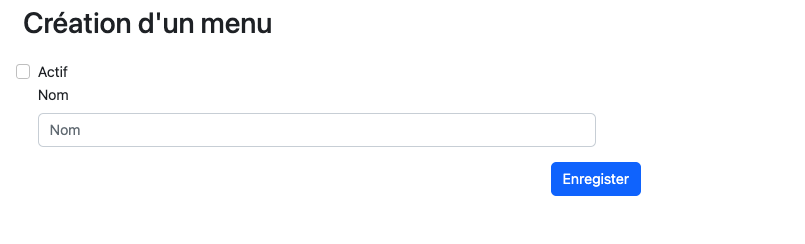
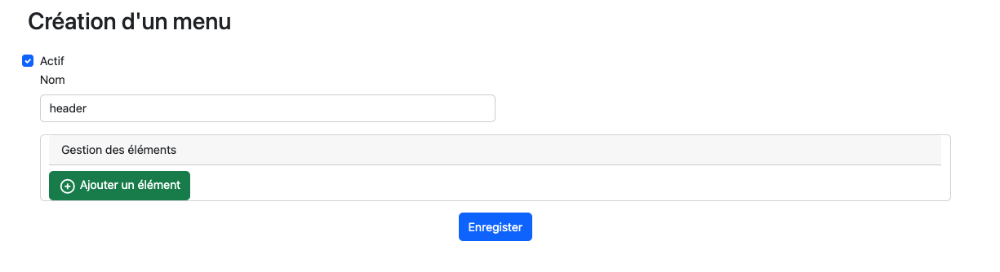
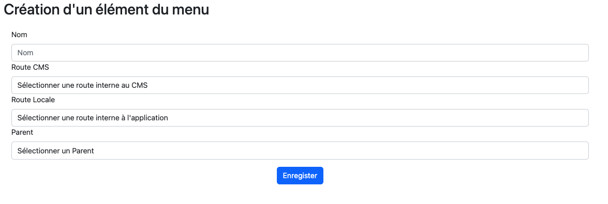
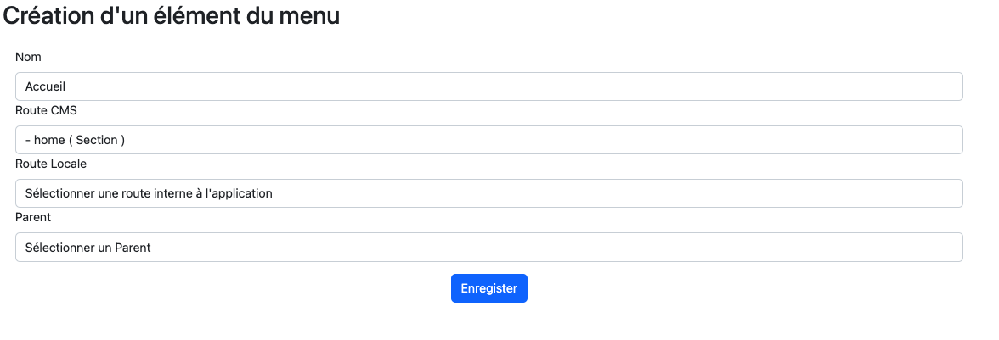
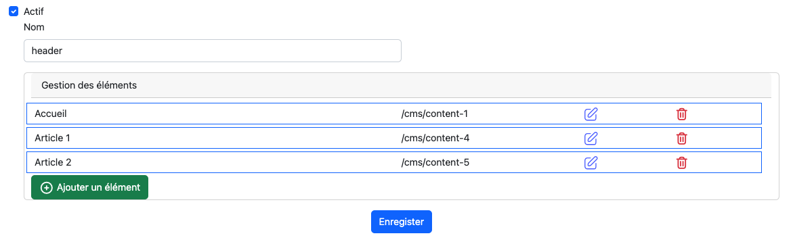

# Sujet Avancer

## Gestion du menu

Dans FractalCMS, il est possible de créer des menus. c'est menu pourront être ensuite récupéré
sur le site et affiché sur la page.

### Interface



### Editer / Ajouter

L'édition d'un article se réalise en cliquant sur le stylet de la ligne.
La création se réalise en cliquant sur le bouton 'Ajouter'.

### Création d'un menu étape 1



Lors de l'ajout d'un menu, il est demandé en étape 1 le nom de ce menu.

* actif : Permet d'activer le menu
* Nom : c'est le nom qui permettra de le trouver, cette valeur est **unique**

### Création d'un menu étape 2

Après avoir saisie un nom unique et valider le formulaire. Le formulaire ce met à jour afin
de permettre d'ajouté des **élements du menu**, en cliquant sur le bouton **Ajouter un élément**.



#### Ajout d'un élément



* Nom : Nom de l'élément
* Route CMS : Lien vers un article actif de FractalCMS
* Route locale : Lien vers une action d'un controller hors FractalCMS de votre application Web
* Parent : L'élément créé peut-être un enfant d'un autre élément.

##### Exemple : Ajout élément "accueil"



#### Après plusieurs ajouts



#### Récupérer le menu sur votre site

Il est possible d'adapter la donnée de retour afin de correspondre à votre logique.

```
public function get($name)
{
    try {
        $result = [];
            $menuId = Cms::getParameter('MENU', $name);
            $menu = Menu::findOne($menuId);
            if ($menu instanceof Menu) {
                $menuItemsQuery = $menu->getMenuItemChild();
                $result = $this->build($menuItemsQuery);
            }
        return $result;
    } catch (Exception $e) {
        Yii::error($e->getMessage(), __METHOD__);
        throw $e;
    }
}

protected function build(ActiveQuery $menuItemsQuery)
{
    try {
        $result  = [];
        /** @var MenuItem $menuItem */
        foreach ($menuItemsQuery->each() as $menuItem) {
            $part = [];
            $contentTarget = $menuItem->getContent()->andWhere(['active' => 1])->one();
            if ($contentTarget instanceof Content || empty($menuItem->route) === false) {
                $route = ($contentTarget !== null) ? $contentTarget->getRoute() : $menuItem->route;
                $part['name'] = $menuItem->name;
                $part['route'] = $route;
                $subMenuQuery = $menuItem->getMenuItems();
                if ($subMenuQuery->count() > 0 ) {
                    $part['child'] = $this->build($menuItem->getMenuItems());
                }
                $result[] = $part;
            }
        }
        return $result;
    } catch (Exception $e) {
        Yii::error($e->getMessage(), __METHOD__);
        throw $e;
    }

}
```

## Personnaliser les vues des éléments de l'article

Dans FractalCMS, nous pouvons personnaliser la vue qui sera utilisée pour générer
le HTML de l'élément dans la partie **Gestion des éléments** du formulaire de création
d'un article.

### Propriété

La propriété public **viewItemPath** de FractalCMS peut-être valorisé dans le fichier de 
configuration. La propriété est valorisée par défaut par  **@webapp/views/fractal-cms**.

### Régle de nommage des vues

Le nom doit correspondre à la valeur de la propriété **name** de la **Configuration de l'élément**. Les noms
comportant des **-** seront automatiquement remplacés par des **_**.

#### Exemples

##### Entête

* Nom : **entete**
* Valeur de la propriété **name** de la configuration : **entete**
* Nom de la vue : **entete.php**

##### Image HTML

* Nom : **image-html**
* Valeur de la propriété **name** de la configuration : **image-html**
* Nom de la vue : **image_html.php**

[<- Précédent](05-content.md) | [Accueil](index.md)