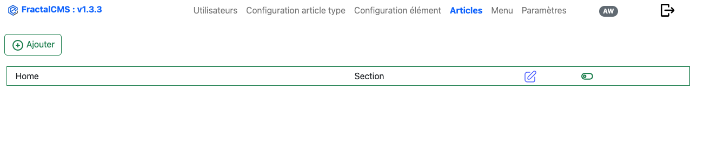
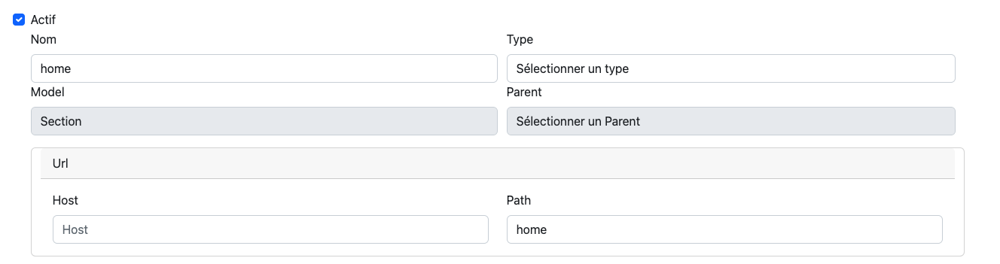
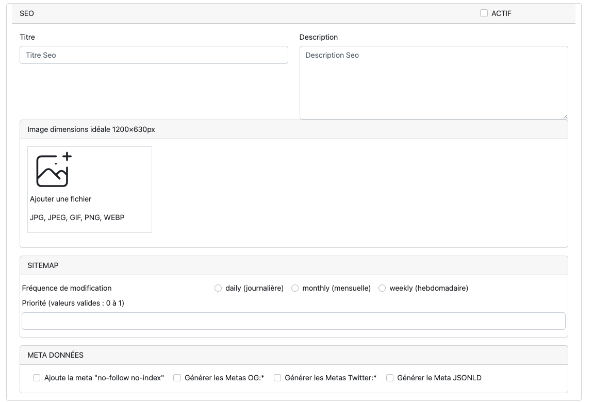
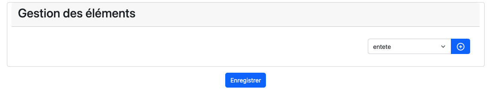

# Création / Mise à jour  d'un article

## Prérequis

Avant de créer un article (Content), veuillez créer une **[Configuration du type d'élément](configurationContentType.md)**.

## Interface

Les articles suivent une structure définie par l'attribut **pathKey**.
Lors de l'initialisation de FractalCMS le **Content** "main" a été créé.

Tous les autres **Content** devront être des enfants ou petits enfants de "main".

Dans la pratique le **Content** "main" est la section qui va définir la page **accueil** du site.

### Editer / Ajouter

L'édition d'un article se réalise en cliquant sur le stylet de la ligne.
La création se réalise en cliquant sur le bouton 'Ajouter'.

### Identification de l'article (partie haute du formulaire)

### SEO

### Gestion des éléments

