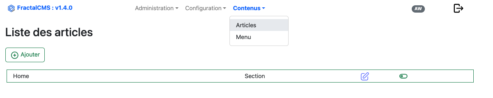

# Création / Mise à jour  d'un article

## Prérequis

Avant de créer un article (Content), veuillez créer une **[Configuration du type d'élément](configurationContentType.md)**.

## Interface

Les articles suivent une structure définie par l'attribut **pathKey**.
Lors de l'initialisation de FractalCMS le **Content** "main" a été créé.

Tous les autres **Content** devront être des enfants ou petits enfants de "main".

Dans la pratique le **Content** "main" est la section qui va définir la page **accueil** du site.

### Editer / Ajouter

L'édition d'un article se réalise en cliquant sur le stylet de la ligne.
La création se réalise en cliquant sur le bouton 'Ajouter'.

### Identification de l'article (partie haute du formulaire)

* Actif : l'article doit-être actif pour être visible sur le front
* Nom : Nom de l'article (cette valeur doit être unique dans le site)
* Configuration de l'article : liste de choix liée aux configurations créés dans [Configuration du type des articles](configurationContentType.md)
* Model : indique si l'article est une **section** ou un **article**
* Parent : Hiérarchie de l'article
* Url : Url à partir de laquelle l'article sera accessible sur le front

#### Configuration de l'article

Cette option permet de définir vers quelle **contrôleur/action** l'url de l'article sera dirigé afin
de construire la vue et l'envoyer au Front.

#### Model

##### Section

Modèle du plus haut niveau dans la hiérarchie, il peut appartenir à une autre **section** mais ne peut-être sous un article.

##### Article

Modèle du plus bas niveau dans la hiérarchie, il ne peut-être que l'enfant d'un modèle **section**

#### Parent

Position dans la hiérarchir de FractalCMS.

#### Url (valeur unique)

L'url est le point d'entrée sur le front (navigateur) afin d'accéder à la page de l'article

Cette valeur doit-être unique dans FractalCMS afin d'être sûr d'accéder à la bonne page sur le front.

### SEO

Le SEO, défini les valeurs à indiquer dans la page afin de valoriser des données récupérées pour l'indéxation du site. 

FractalCMS met à disposition le **behavior** **fractalCms\behaviors\Seo**qui peut-être utilisé afin de générer le SEO.

* Actif : Activé le SEO
* Titre : titre visible sur l'onglet du navigateur
* Description : valeur du **meta** **name:description**
* Image : valeur du **meta** **name:image**
* Sitemap : paramètre inscrit dans le sitemap.xml pour l'url de cette article
* Meta données : Permet d'activer les metas données supplémentaire

#### Sitemap

FractalCMS met à disposition l'action **fractalCms\actions\SitemapAction** qui se charge de générer le fichier sitemap.xml.

#### Meta données

Le jsonLd doit-être créé selon les articles et le contexte du site.

### Gestion des éléments

Ici, ce trouve la coeur de la page. chaque article qu'il soit **section** ou **article** doit comporter des éléments.

Chaque élément est basé sur une configuration voir : [Gestion de la configuration des éléménts](configurationItemType.md).

#### Ajout d'un élément

Dans la liste en bas à droite, il faut sélectionner l'élément choisi et cliquer sur "+".

La liste contient les *configurations éléments* précédemment créés [Gestion de la configuration des éléménts](configurationItemType.md).

.

