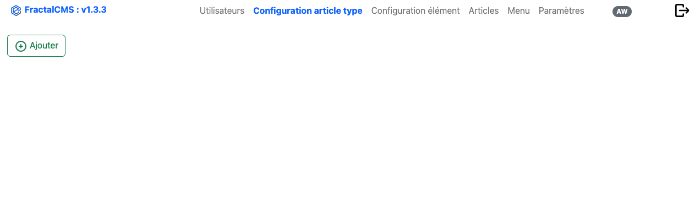
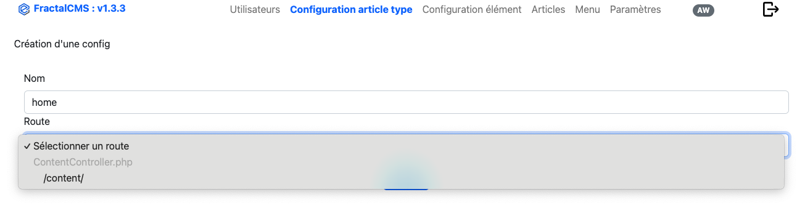
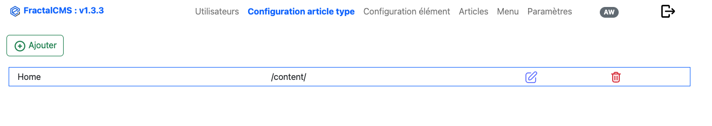

# Configuration du type d'élément

Le configuration du type d'élément faite partie des concepts important de FractalCMS. C'est grâce à cette configuration qu'un
élément (Content) pourra être dirigé vers le bon **Controller** et la bonne  **Action** et permettre
ainsi de construire une vue adapté à vos besoin.

## Interface



## Principe

Dans votre application Yii, ajouté un **Controller** qui étant **fractalCms\controllers\CmsController**, dans lequel vous allez 
créer l'action désirée ex :

```php
<?php

namespace webapp\controllers;

use fractalCms\controllers\CmsController;
use fractalCms\models\Content;
use Yii;
use Exception;

/**
 * ContentController class
 *
 * @author David Ghyse <dghyse@redcat.fr>
 * @version XXX
 * @package webapp\controllers
 * @since XXX
 */
class ContentController extends CmsController
{

    /**
     * @return \yii\web\Response|string
     * @since XXX
     */
    public function actionIndex()
    {
        try {
            Yii::debug('Trace :'.__METHOD__, __METHOD__);
            /** Content $content **/
            $content = $this->getContent();
            $itemsQuery = $content->getItems();
            return $this->render('index',
                [
                    'content' => $content,
                    'sections' => $sections
                    ]);
        } catch (Exception $e) {
            Yii::error($e->getMessage(), __METHOD__);
            throw $e;
        }
    }
}

?>
 ```

### Ajout une configuration

Afin d'ajouter une configuration, il suffit de cliquer sur "Ajouter", le formulaire de création apparait.



A ce stade, nous voyons apparaitre la liste des types qui ont été ajoutés dans l'application.
Nous allons créé le type **home** que nous allons diriger vers le contrôleur **ContentController** et l'action **actionIndex**.

* ici : **\content\** dans la liste.

## Retour à la liste

Le type **home** est maintenant créé et est visible dans l'interface.



## Conclusion

Désormais, tout article ou section qui aura le type **home** sera dirigé vers l'action **actionIndex** du 
contrôleur **ContentController**.