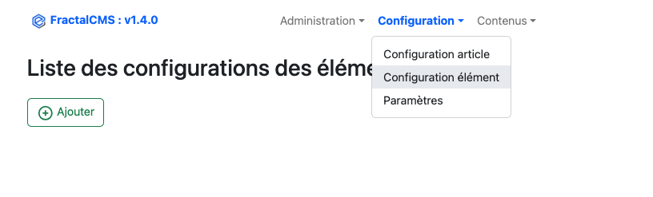

# Gestion de la configuration des éléménts

Tous les articles peuvent avoir des éléments. Ces éléments permettent de définir les informations
qui seront utiles pour générer le HTML finale.

Chaque élément doit-être configuré avant de pouvoir être visible dans l'article.

## Interface



## Editer / Ajouter

Afin d'ajouter une nouvelle configuration d'un élément, il faut cliquer sur **Ajouter**.


* Nom : nom de la configuration, cette valeur doit-être unique
* Configuration Json : Ajout des attributs et leur définition qui sera utiliser pour générer 
le HTML de l'élément dans l'article et définir les attributs à utiliser voir (https://github.com/josdejong/jsoneditor)

### paramétrage d'un attribut

Chaque attribut doit comporter au moins ces paramètres pour être utilisable.

* Son nom : nom de l'objet intitulé de l'attribut dans model final
* Type : type de l'attribut 
    * "**string**" : Champ input type text
    * "**text**" : Champ input type textarea
    * "**file**" : champ input type file
    * "**radio**" : champ input type radio
    * "**checkbox**" : champ input type checkbox
    * "**wysiwyg**" : champ input type text avec une interface _wysiwyg_ (https://quilljs.com/)
    * "**listcms**" : champ input dropdown list contenant les articles de FractalCMS ainsi que les _controller/action_
* 
* Title : intitulé à afficher dans l'article

```json
{
  "title": {
      "type": "string",
      "title" : "Titre de la section"
  }
}
```

## Exemple réel

### Création d'un élémént _entête_


```json
{
  "title": {
    "type": "string",
    "title": "Titre"
  },
  "subtitle": {
    "type": "string",
    "title": "Sous-titre"
  },
  "description": {
    "type": "wysiwyg",
    "title": "Description"
  },
  "banner": {
    "type": "file",
    "title": "image en 1200x250",
    "accept": "png, jpeg, jpg"
  },
  "alt": {
    "type": "string",
    "title": "Alt de l'image"
  }
}
```

### Utilisation dans l'interface de mise à jour d'un article

**Choix et ajout de la configuration _entete_**


**Ajout de la configuration dans l'article**


Désormais, l'élément peut-être configuré et enregistré. les ioformations pourront ête utilisées 
sur le _front_.
