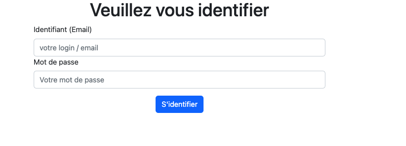
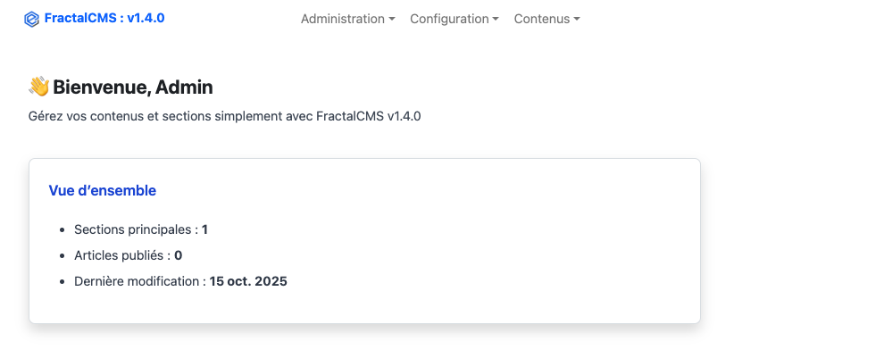

# Interface administrateur

## Se connecter

Afin d'accéder à l'interface administrateur, il faut se connecter en utilisant l'utilisateur créé avec la commande :

``
php yii.php fractalCms:admin/create
``

## Interface "tableau de bord"

A la connexion, l'utilisateur arrive sur l'interface "tableau de bord", sur cette page est affiché un récapitulatif
rapide des contenus créés ou mis à jour.

## Le header

Dans le header on peut trouver, la version de FractalCMS, le menu, les initiales de l'utilisateur connecté,
le bouton de déconnexion.

## Le menu

Ce menu est généré en fonction des droits accessible par l'utilisateur, l'utilisateur "administrateur" à tous les
droits.
Lors de la création d'un nouvel utilisateur les droits associés peuvent être paramétré.

* [Utilisateurs - Gestion des utilisateurs](utilisateurs.md)
* [Configuration article type](configurationContentType.md)
* [Configuration élément](configurationItemType.md)
* [Articles](articles.md)
* [Menu](menu.md)
* [Paramètres](parameters.md)