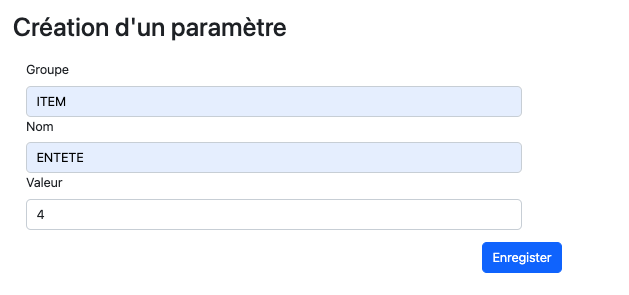

# Gestion des paramètres

Nous avons parfois besoin de récupérer des identifiants, des valeurs, des informations etc...
La gestion des paramètres est utile dans ces cas précis où nous devons indiquer une valeur qui pourrait évoluer
selon l'environnement dans lequel nous sommes.

Exemple : Identifiant technique différent entre la **production** et la **pré-producion**.

## Interface


## Editer / Ajouter

L'édition d'un article se réalise en cliquant sur le stylet de la ligne.
La création se réalise en cliquant sur le bouton 'Ajouter'.

## Formulaire de création


* Groupe : Groupe principal du paramètre
* Nom : Nom du paramètre
* Valeur : Valeur du paramètre (string ou integer) ...

### Exemple : Création d'un paramètre contenant l'_id de la configuration de l'élément entête_



Pour récupérer cette valeur dans votre code, une fonction existe dans **fractalCms\helpers\Cms**.

### Exemple de recherche du premier élément **entete** dans un **article**

``` 
    public function actionIndex()
    {
        try {
            Yii::debug('Trace :'.__METHOD__, __METHOD__);
            $content = $this->getContent();
            //Recherche du premier élément "entete" du "Content"
            $itemEntete = $content->getItems()
                ->andWhere(['configItemId' => Cms::getParameter('ITEM', 'ENTETE')])
                ->one();
            return $this->render('index',
                [
                    'content' => $content,
                    'entete' => $itemEntete,
                    ]);
        } catch (Exception $e) {
            Yii::error($e->getMessage(), __METHOD__);
            throw $e;
        }
    }
```